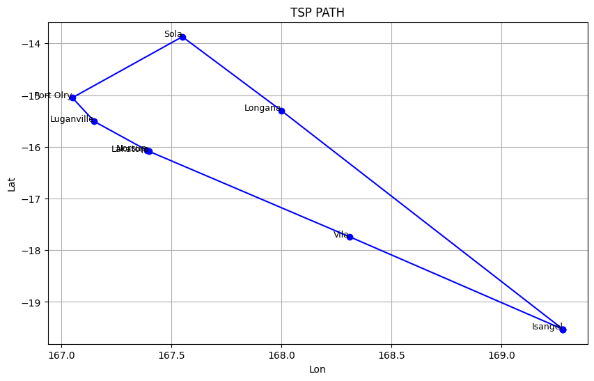

# CI2024_lab2
solve the given TSP instances using both a fast but approximate algorithm and a slower yet more accurate one.
Report the final cost and the number of steps

## Tested algorithms
For this task, different approaches have been tested:
- The first approach is a greedy approach that starting from a node, selects the nearest unvisited node, and marks it as visited until all nodes have been selected. This results in a reasonably good solution with a number of steps equal to the number of nodes.
- The second approach is also a greedy one, but instead of working on nodes, it operates on edges by selecting all the shortest edges until it has 
𝑛
n edges and a degree of 2 for each node ensuring that each new edge selected does not create a premature cycle before all nodes have been selected
- The third approach is a simulated annealing method that utilizes four different types of mutations, each chosen randomly with equal probability:
    - `inverse(state)`
    This mutation randomly selects two nodes within the route (excluding the first and last nodes to keep the route closed) and reverses the order of the nodes between these two nodes.

    - `insert(state)`
    This mutation removes a randomly chosen node (excluding the first and last nodes) and reinserts it at a new random position within the route.

    - `swap(state)`
    In this mutation, two nodes are randomly selected (excluding the first and last nodes) and swapped with each other. 

    - `swap_routes(state)`
    This mutation selects two subroutes within the main route and swaps them. The selected subroute is removed and reinserted at a different position

- The fourth approach is a genetic algorithm that uses an inver-over type crossover, alternating with a 2:8 ratio with the mutations used in the simulated annealing.  
A population size of 500 and a maximum number of generations without improvement of 3000 were used. Additionally, a minimal chance was introduced to select both genes from the same parent as in the paper below. 

## Some Results
| Dataset      | First Greedy       | Greedy Edges | Simulated annealing |GA with inver over Crossover|
|--------------|--------------------|--------------|---------------------|----------------------------|
| Vanuatu      | 1475.53km , 8 steps | 1475.53km , 33 steps    | 1345.54km ,33810 steps           | 1345.54km , 3005 generations                   |
| Italy        | 4436.03km , 46 steps      | 4730.05 km , 2977 steps     | 4174.94km ,61047 steps            |  4172.76km , 3194 generations                 |
| Russia       | 42334.16km , 167 steps      | 39758.48 km , 102543 steps    | 33637.90km , 255277 steps           | 34915.47km , 5724 generations                  |
| Us           | 48050.03km , 326 steps    | 45845.92 km , 406764 steps    | 45845.92km , 73639 steps | 39912.65km , 10688 generations                  |
| China        | 63962.92km , 726 steps     | 59367.32 km , 1933270 steps    | 59367.32km , 77249 steps | 52059.72km , 42259 generations                  |

## Plot example
here an example of the vanuatu dataset TSP calculated with the simulated annealing and GA approach (same result)  

## Conclusion
Among the greedy approaches, the one that works on edges achieved better results on almost all instances compared to the one that works on nodes, but with a significantly higher number of steps to reach the solution.

As for the other two approaches:
- the simulated annealing performed quite well, although there could certainly be improvements by adjusting the temperature, cooling rate, and perhaps introducing different proportions for various types of mutations.
- The GA with inver-over crossover, although it almost always performs better than the other approaches, sometimes gets stuck in local optima.  
In this case, it would certainly be effective to search for suitable population values and maximum no_improvement_count to prevent the algorithm from getting stuck in a local maximum for too long. Additionally, the probabilities of different mutations (shared with the simulated annealing) could also be adjusted, along with the mutation rate versus crossover rate.

## CREDITS
For the simulated annealing, I took inspiration from this article  
https://medium.com/@francis.allanah/travelling-salesman-problem-using-simulated-annealing-f547a71ab3c6  

For the inver-over crossover, I tried to follow this approach.  
https://www.semanticscholar.org/paper/Inver-over-Operator-for-the-TSP-Tao-Michalewicz/0907abb6e00b6b056baaf82b1e37d2d4affdaffa